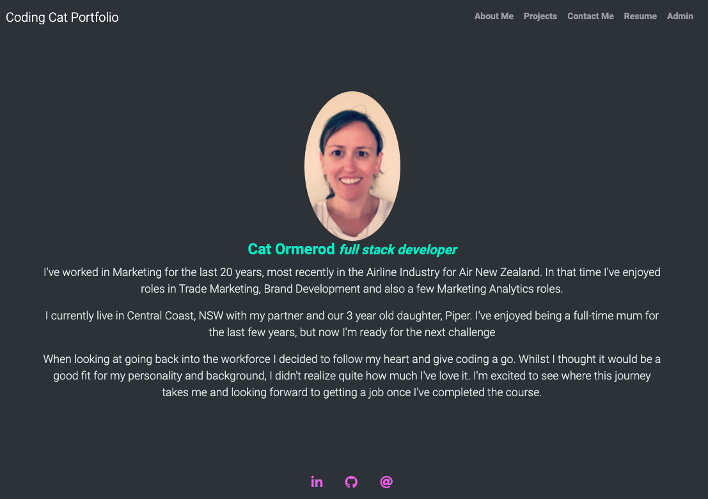
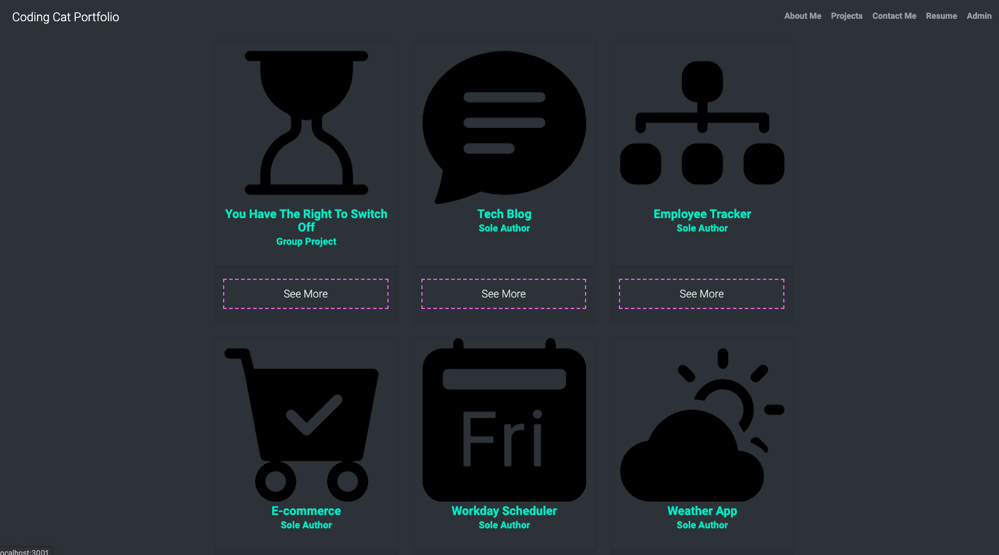
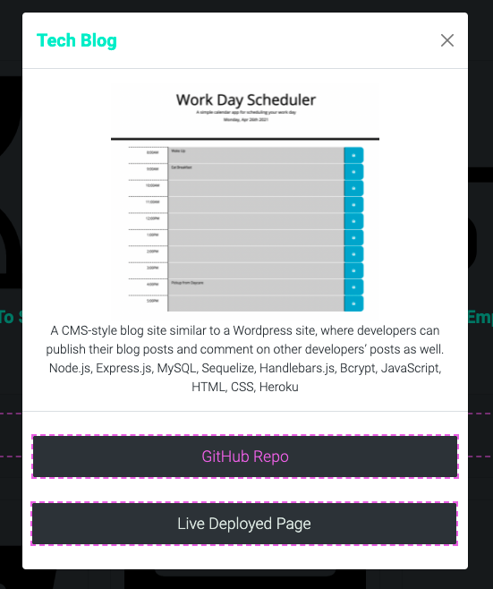
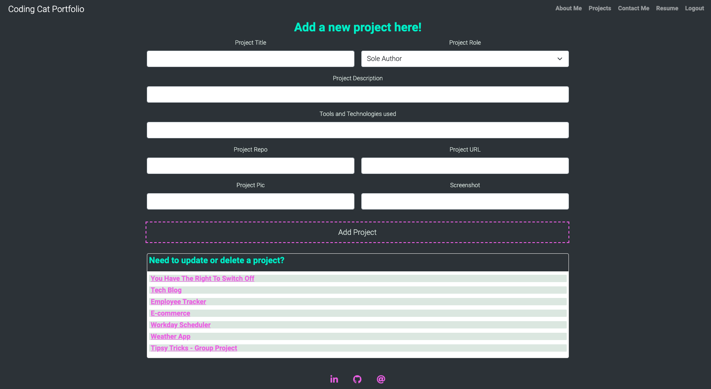
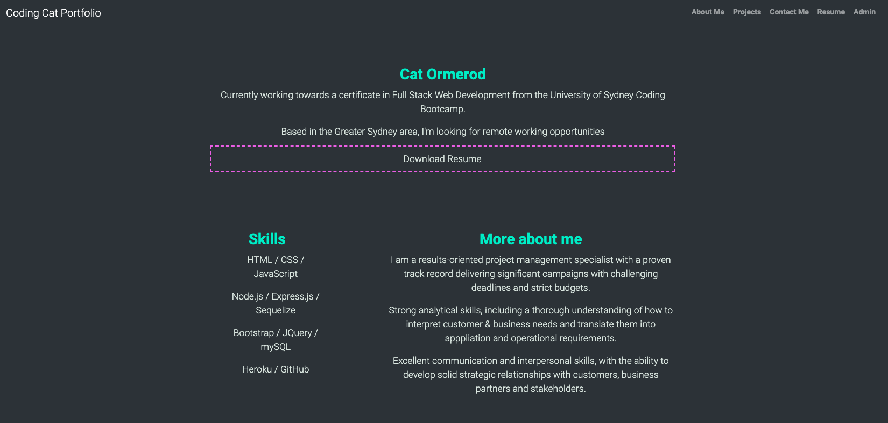

# coding-cat-portfolio
An updated portfolio utilising the most recently learned tools and technologies

## Description & LIVE DEPLOYED WEBSITE
---
The app can be viewed live [here](https://coding-cat-portfolio.herokuapp.com/).  For more information see below. 

I decided to fully update the website using MVC so that I could continue to update my projects as I add them in a CMS like page.  I also added a few new technologies like nodemailer, so that if anyone wants to get in touch with me after looking at my porfolio, it emails me with their details. 

## Screenshots
---
The following images show the web application's appearance and functionality: 
The homepage, which defaults to About me!

The Projects page, which lists all my favourite projects!

The Modal, which shows all the detail on each project!

The Profile Page, this only shows once logged in.  Here is where you can add projects or amend & delete them.

Resume Page where you can view some highlights on the page, or download the full resume

## Tools & Technologies
---
    - mysql
    - express
    - sequelize
    - dotenv to hide personal data
    - handlebars with handlebars helpers to render the pages
    - bcrypt - used in conjuction with 'withAuth' to ensure the user password was secure, and that they only saw sections of the website whilst logged in.
    - nodemailer - used to trigger an email to myself if anyone fills in the contact me page
    - I was having a lot of minor buggy problems with my styling and realised that I was on an old version of bootstrap, so I updated to Bootstrap v5, which broke a lot of things in my website.  I worked through the website, page by page and managed to update everything.  This then meant I could get rid of a lot of the styling in the CSS page.  

## Installation 
---
Step 1 - Clone the github repo

Step 2 - Enter your details in the EXAMPLE .env file and save as .env

Step 3 - Right click the server.js file and `Open in intergrated Terminal`, and run `npm i` to install dependancies

Step 4 - Enter `mysql -u <username> -p` in terminal (this will open sql shell)

Step 5 - Enter your password

Step 6 - Enter `source db/schema.sql`, once this has run enter `quit` to exit the shell

Step 7 - Enter `npm run seed` to seed the test data into the database

Step 8 - Enter `npm start` to open the server connection

Step 9 - Open your browser and enter`localhost:3001/`

Note: you will need to replace yourself as an admin to the seed file in order to access the admin page, or use the example login details for myself there.  

## Questions?
---
If you have any questions about this project, please contact me directly on [email](mailto:catormerod@gmail.com). You can view more of my projects at [Github](https://github.com/catormerod) or this specific project at [coding-cat-portfolio](https://github.com/CatOrmerod/coding-cat-portfolio). 

The app can be viewed live [here](https://coding-cat-portfolio.herokuapp.com/). 